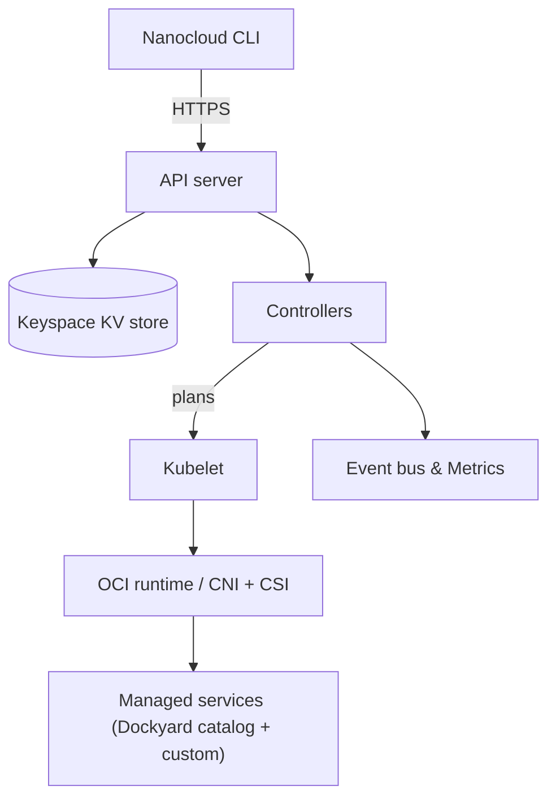
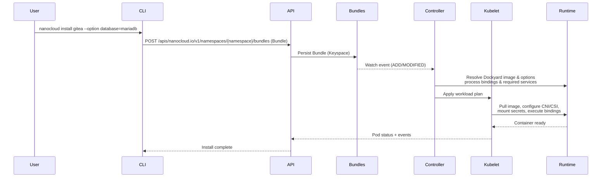

# Nanocloud

Nanocloud is a single-binary container platform that delivers a Kubernetes-flavoured control plane, runtime, and curated application catalog to a standalone node. The binary you build is the same binary that runs the HTTPS API server, controllers, keyspace store, kubelet, and CLI, so you can provision, patch, and observe services without first assembling a cluster.

## Highlights
- **Single deployment artifact** – `nanocloud` embeds the API server, watchable Keyspace store, controller manager, kubelet, and OCI runtime.
- **Kubernetes-aligned APIs** – bundles, pods, configmaps, events, and watch semantics mirror Kubernetes conventions while remaining local.
- **Self-contained runtime stack** – built-in CNI bridge (`nanocloud0`), CSI driver, streaming backup engine, encrypted secret store, and a Rust OCI runtime replace external dependencies.
- **Dockyard images** – curated images hosted at `registry.nanocloud.io` advertise options, defaults, and bindings through the `io.nanocloud.options` label.
- **Bindings-first configuration** – service relationships (database, TLS, identity) are expressed once in image metadata and enforced during reconciliation.
- **Operational safety** – TLS-only APIs, client-certificate bootstrap flows, exec/session metrics, and declarative backup retention ship out of the box.

## Architecture in Brief



- **CLI & HTTP API** – CLI subcommands (`install`, `status`, `exec`, etc.) share the same API server endpoints your automation can call.
- **Keyspace** – a file-backed, watchable key/value store persists bundle specs, workload state, secrets, and controller metadata with TTL support.
- **Controllers** – bundle, stateful set, network policy, and snapshot controllers reconcile specs into actionable plans while emitting Kubernetes-style events.
- **Kubelet & runtime** – a Rust kubelet uses the local OCI runtime to pull Dockyard images, apply CNI/CSI configuration, mount encrypted volumes, and supervise containers.

### Install Flow



## Dockyard Images & Bindings

Dockyard is the official image library bundled with Nanocloud. Each image advertises a structured option surface via the `io.nanocloud.options` label:

- **Options with decorators** – `?optional`, `name=value`, `*requires_option`, and `&binding` modifiers describe defaults, dependencies, and whether an option selects another service.
- **Macros** – runtime helpers like `!dns`, `!local_ip`, `!rand <len> <charset>`, `!tls <key|cert|ca>`, and `!if key=value` inject environment-aware values without templating.
- **Bindings** – when an option selects another service (`database=&mariadb`), binding templates describe the commands required to finish bootstrapping (user creation, TLS export, etc.). During reconciliation Nanocloud expands the templates, executes them inside the dependent workload namespace, and records the outcome.
- **Profiles** – resolved options, secrets, and bindings are written back to the bundle profile so restarts, updates, and snapshots rehydrate the exact configuration.

As a result, a command such as `nanocloud install gitea --option database=mariadb --option database_transport=tls` carries enough metadata for Nanocloud to negotiate MariaDB credentials, request TLS material, seed volumes, and boot the service without additional scripts.

## Install Locally

```bash
make release && make package && sudo make install
```

Requires a standard Rust toolchain installation (e.g., via `rustup`) so the `cargo` build can run; the sequence produces a Debian package and installs it on the host.

## Getting Started

```bash
# Prepare secure assets, network bridge, and backup retention
sudo nanocloud setup

# Copy the single-use token emitted at the end of setup
TOKEN="<paste token here>"

# Generate a kubeconfig installer script and apply it
nanocloud config --token "$TOKEN" | sh

# Run the HTTPS control plane (default 127.0.0.1:6443)
sudo nanocloud server --listen 0.0.0.0:6443

# Install a Dockyard workload with default
nanocloud install kafka

# Monitor the service
nanocloud status
nanocloud logs kafka --follow
nanocloud exec kafka -- sh
```

### Frequently Used Commands
- `nanocloud install|start|stop|restart <service>` – manage workloads.
- `nanocloud uninstall <service> --snapshot backups/service.tar` – tear down while streaming the latest backup tarball.
- `nanocloud config --user admin --token <value>` – emit kubeconfigs backed by single-use tokens or client certificates.
- `nanocloud diagnostics` – reconcile local CNI artifacts and nftables rules.
- `nanocloud volume unlock --device /dev/loop0 --key <name>` – manage encrypted volumes exported by services.

## REST API Surface

Nanocloud exposes Kubernetes-style endpoints for its custom resources alongside convenience endpoints for lifecycle helpers:

- **Bundles (custom resource)**  
  - `GET, POST /apis/nanocloud.io/v1/namespaces/{namespace}/bundles`  
  - `GET, DELETE /apis/nanocloud.io/v1/namespaces/{namespace}/bundles/{name}`
- **Devices (custom resource)**  
  - `GET, POST /apis/nanocloud.io/v1/namespaces/{namespace}/devices`  
  - `GET, DELETE /apis/nanocloud.io/v1/namespaces/{namespace}/devices/{name}`  
  - `POST /apis/nanocloud.io/v1/namespaces/{namespace}/devices/certificates`
- **Ephemeral certificates (cluster-scoped custom resource)**  
  - `POST /apis/nanocloud.io/v1/certificates`
- **Bundle lifecycle subresources**
  - `POST /apis/nanocloud.io/v1/namespaces/{namespace}/bundles/{name}/actions/start`
  - `POST /apis/nanocloud.io/v1/namespaces/{namespace}/bundles/{name}/actions/stop`
  - `POST /apis/nanocloud.io/v1/namespaces/{namespace}/bundles/{name}/actions/restart`
  - `POST /apis/nanocloud.io/v1/namespaces/{namespace}/bundles/{name}/actions/uninstall`
  - `GET /apis/nanocloud.io/v1/namespaces/{namespace}/bundles/{name}/backups/latest`

Controller discovery endpoints (`/apis/nanocloud.io/v1`, `/api/v1`) list the available resources for clients that mirror Kubernetes discovery.

## Runtime & Platform Capabilities

- **OCI runtime** (`src/nanocloud/oci/runtime.rs`) – pulls layers, constructs bundle roots, mounts encrypted volumes, attaches namespaces, and streams structured logs.
- **CNI** (`src/nanocloud/cni`) – reconciles the `nanocloud0` bridge, applies per-pod routing, and integrates with the network policy controller.
- **CSI** (`src/nanocloud/csi`) – provisions volumes, handles `NodePublishVolume` flows, maintains volume inventory, and exposes snapshot APIs.
- **Controllers** (`src/nanocloud/controller`) – bundle/statefulset/network policy/snapshot controllers coordinate desired state and publish events to the in-memory bus.
- **Keyspace secrets** (`src/nanocloud/secrets`) – secrets are envelope-encrypted, digested via HMAC, and versioned alongside the backing resource.
- **Scheduler** (`src/nanocloud/scheduler`) – cron/interval executor backs recurring tasks such as token rotation and diagnostics.

## Backups & Snapshots

- **Streaming backups** – workloads register streaming snapshot callbacks so uninstall flows and `/apis/nanocloud.io/v1/namespaces/{namespace}/bundles/{name}/backups/latest` can deliver artifacts without staging to disk.
- **Retention** – `kube-system/nanocloud.io` ConfigMap (`backup.retentionCount`) governs per-service retention; pruning runs automatically during bundle lifecycle operations.
- **Volume snapshots** – the snapshot controller persists `VolumeSnapshot` specs in Keyspace and integrates with the CSI driver to manage artifacts and lifecycle events.

## Observability & Diagnostics

- **Metrics** – Prometheus metrics (exec session counts, keyspace queue depth, CNI health, backup throughput, etc.) publish on `/metrics`.
- **Events** – Kubernetes-style `Event` objects are generated for bundle phases, reconciler failures, and binding status, making troubleshooting familiar.
- **Diagnostics** – the CLI streams container logs, exposes watch APIs, checks CNI state, and reports controller findings to shorten feedback loops.

## Security & Access

- **TLS everywhere** – the server runs with TLS enabled; `NANOCLOUD_REQUIRE_CLIENT_CERTIFICATE=true` enforces mutual TLS for API clients.
- **Tokens** – `nanocloud token` issues short-lived grants (renderable as QR codes) which can be exchanged for service-account JWTs or client certificates.
- **Secure assets** – `nanocloud setup` prepares `/var/lib/nanocloud.io/secure_assets`, generates encryption keys, and keeps them off the container filesystem.
- **Bindings safety nets** – option validation ensures binding prerequisites are satisfied before commands execute, preventing privilege mismatches between workloads.

## Project Status

- The runtime, API surface, controllers, binding engine, Keyspace-backed persistence, and streaming backup pipeline are production-ready and covered by automated tests.
- Dockyard images continue to expand; the option/binding schema is stable and used by the built-in catalog.
- Kubernetes conformance is not a goal, but Nanocloud intentionally mirrors Kubernetes idioms so manifests, tooling, and mental models stay familiar.

## Contributing

Issues and pull requests are welcome. When authoring Dockyard images, follow the `io.nanocloud.options` schema so new services inherit the same binding and macro capabilities. Runtime or controller changes should include unit tests (`src/nanocloud/**`) and, where relevant, integration coverage (`tests/`).
