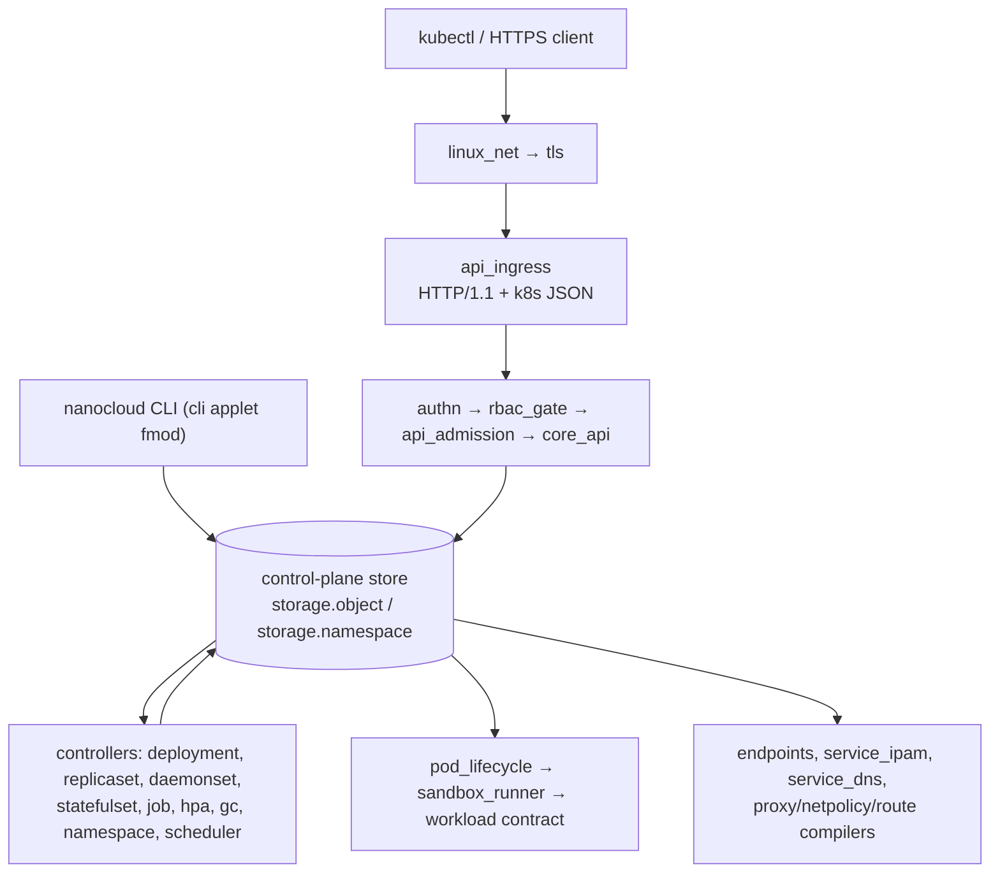

# Nanocloud

Nanocloud is a Kubernetes control plane built entirely from [fluxor](../fluxor/)
modules. The apiserver, the request pipeline, every reconciler, the node
runtime and the CLI are `no_std` position-independent modules (`.fmod`) that
run as cooperating nodes of a fluxor graph over one shared store. There is no
host binary and no separate database: install the package, start one systemd
unit, and the node serves the Kubernetes API.

## Highlights

- **The control plane is a graph.** `fluxor run controlplane.yaml` starts the
  apiserver, the authn → authz → admission → CRUD pipeline, and every workload
  controller as modules in a single runtime. Composition is a YAML graph, not a
  process tree.
- **Kubernetes-shaped API.** `kubectl` talks to it directly: core/v1,
  `apps/v1`, `discovery.k8s.io/v1`, `node.k8s.io/v1` and `nanocloud.io/v1`
  discovery documents, list/get/create/update/delete, and `?watch=true`
  watches fenced on the store's own revisions.
- **One store, single writer.** Control-plane state lives in fluxor's
  `storage.object` / `storage.namespace` contracts — versioned keyed bytes with
  compare-and-swap, prefix listing and change subscriptions. The graph is its
  only writer, so a watch is a projection of the store's revision stream rather
  than a poll.
- **Host facts stay behind capability surfaces.** A module never calls libc.
  Sockets arrive through `linux_net`/`tls`, containers through the `workload`
  contract, files through `fs`, private keys through the kernel key vault — each
  one a contract admission can gate.
- **Decision and effect are separate.** Controllers compute; the node's backends
  act. The network compilers publish an nftables ruleset to the store rather
  than programming the kernel themselves; the kubelet's decision half projects
  desired sandboxes, and the runner performs them.
- **Behaviour is proven on real binaries.** There are no unit tests to mock the
  seams: `make test` boots the built `.fmod` artefacts in a fluxor runtime and
  drives them over real HTTP, the real store, and real mTLS.

## Architecture


```mermaid
flowchart TD
    CLI["nanocloud CLI (cli applet fmod)"] --> Store[("control-plane store<br/>storage.object / storage.namespace")]
    Client["kubectl / HTTPS client"] --> TLS["linux_net → tls"]
    TLS --> Ingress["api_ingress<br/>HTTP/1.1 + k8s JSON"]
    Ingress --> Pipe["authn → rbac_gate → api_admission → core_api"]
    Pipe --> Store
    Store --> Ctrl["controllers: deployment, replicaset, daemonset,<br/>statefulset, job, hpa, gc, namespace, scheduler"]
    Ctrl --> Store
    Store --> Node["pod_lifecycle → sandbox_runner → workload contract"]
    Store --> Net["endpoints, service_ipam, service_dns,<br/>proxy/netpolicy/route compilers"]
```

Every arrow into or out of the store is a contract call, and the API and
controller modules never address each other directly — the only direct channels
are the net streams at the edge and each module's own change sink. A request is
admitted at the edge, written once, and every controller that cares wakes on
the change and writes its own outputs back. [docs/architecture/modules.md](docs/architecture/modules.md) describes
each module, the keys it owns, and the capability surfaces it holds.

## Install

The package is built from this checkout against a sibling fluxor tree:

```bash
fluxor update && fluxor sync            # resolve + materialise deps and the SDK
make build                              # build modules/app/* for bcm2712
packaging/debian/build.sh               # stage the .deb
tools/install_deb.sh                    # dpkg -i the newest build, restart the unit
```

The package installs the fluxor CLI and runtime, every nanocloud `.fmod`, the
control-plane graph (`/etc/nanocloud.io/fluxor/controlplane.yaml`), the node and
image-plane graphs, and a systemd unit that runs the control-plane graph with
`FLUXOR_STORE_DIR` pointed at `/var/lib/nanocloud.io/control-plane/store`.
`/usr/bin/nanocloud` is a busybox-style symlink to `fluxor`, so `nanocloud <cmd>`
dispatches the `nanocloud_cli` applet.

## Using it

```bash
sudo systemctl start nanocloud          # run the control-plane graph

nanocloud status                        # cluster object counts
nanocloud get pods                      # list object names under a resource
nanocloud get pods default/web-0        # show one object's stored fields
nanocloud describe pods default/web-0   # a labelled read of one object
nanocloud apply deployments default/web '{"spec":{"replicas":3, ...}}'
nanocloud scale deployments default/web 5
nanocloud delete pods default/web-0
nanocloud rollout status default/web    # progress against the current template
nanocloud rollout undo default/web      # restore the archived previous template
nanocloud watch pods                    # stream a listing as it changes
nanocloud logs -f <sandbox>             # a sandbox's stdout/stderr
nanocloud exec -it <sandbox> -- sh      # a command inside a sandbox
nanocloud diagnostics                   # counts across every resource + health
nanocloud policy                        # NetworkPolicies + the compiled ruleset
nanocloud volume                        # PVCs and the volumes bound to them
nanocloud bundle export > cluster.txt   # every object as `<key>\t<json>` lines
nanocloud bundle apply < cluster.txt    # recreate them from that dump
nanocloud token default-sa default      # mint a ServiceAccount JWT
nanocloud ca                            # print the cluster CA certificate
```

The CLI drives the store directly through the storage contracts, so it works
without the HTTP edge. `kubectl` reaches the same objects over the API, which
`api_ingress` serves on :7443:

```bash
kubectl --server https://127.0.0.1:7443 get pods -A --watch
```

## The API surface

| Group | Resources |
| ----- | --------- |
| core/v1 | pods (+ `pods/log`, `pods/exec`), services, endpoints, configmaps, secrets, events, persistentvolumeclaims |
| apps/v1 | deployments, replicasets, statefulsets, daemonsets |
| discovery.k8s.io/v1 | endpointslices |
| node.k8s.io/v1 | runtimeclasses |
| nanocloud.io/v1 | bundles, roles, rolebindings, volumesnapshots, certificates |

`api_ingress` serves the discovery documents (`/api`, `/apis`, `/api/v1`,
`/apis/<group>/<version>`), `/version`, `/healthz`, `/openapi.json` and
`/metrics` directly, and routes everything else through the request pipeline.
Namespaced paths (`/apis/<group>/<v>/namespaces/<ns>/<resource>[/<name>]`) and
cluster-scoped paths both resolve to the same generic CRUD module; a grouped
resource is keyed group-qualified (`deployments.apps`) so it never collides with
a same-named resource in another group. `?watch=true` on a collection is served
by `watch_streamer` as a long poll fenced on the store revision the client last
saw.

## Security

- **TLS at the edge.** The `tls` module terminates TLS 1.3 in front of
  `api_ingress`. With a peer-auth profile it verifies client certificates and
  emits a per-session SPIFFE-style peer identity, which `api_ingress` carries
  into the pipeline as the request's credential.
- **Signed bearer tokens.** `sa_token` mints ES256 ServiceAccount JWTs, signing
  by handle against a key held in the kernel key vault, and publishes the
  verification key for `authn` to load. No credential is ever stored: a token is
  admitted because its signature verifies, not because a record exists.
- **Deny-by-default authorization.** `rbac_gate` resolves RoleBindings to Roles
  and admits a request only when a rule matches its verb and resource.
- **Admission before the store.** Every mutating request crosses
  `api_admission`, which validates required fields, applies defaults and
  enforces per-resource quota against live counts.
- **Certificates in-module.** `cert_manager` mints X.509 leaves with an
  in-module ASN.1 DER encoder, signing by handle against a CA key in the kernel
  key vault so the private key never re-enters the module. It is a
  development-only issuer and refuses to construct without `development: 1` in
  its graph — it regenerates its CA at every start, returns leaf private keys
  as plaintext on the store, and lets the caller choose its own SAN. A
  deployment issues from kagi's certificate endpoint instead.

## Development

```bash
make build     # fluxor build   — compile modules/app/* to .fmod
make test      # fluxor test    — run scripts/*-e2e.sh against the built modules
make lint      # fluxor lint    — the source-tree hygiene suite
make ci        # fluxor ci      — lint + strict build + the full E2E gate
make publish   # fluxor publish
```

Each lifecycle target delegates to its `fluxor` verb, which reads this
project's shape from `fluxor.toml`. There is no cargo crate: the modules are
`no_std` PIC sources that compile against the SDK `fluxor sync` materialises
under `target/fluxor/fluxor-abi/sdk/`. `make lint` is therefore the source-tree
hygiene suite, which needs no build; formatting and clippy compile the PIC
sources per target, so they run as `make ci` phases.

The hygiene scanner enforces two rules that matter here: every `#[allow]`
carries a `reason`, and inline `#[cfg(test)]` blocks are forbidden under
`modules/` — in a `no_std` PIC module they compile away silently, so a green
run would prove nothing. Behaviour is proven by the graph E2Es in `scripts/`,
each of which boots a real runtime with the real `.fmod` artefacts and asserts
on the store and the wire.

```
fluxor.toml / fluxor.lock       project shape and registry-pinned dependencies
modules/app/<name>/             one module: mod.rs + manifest.toml
modules/app/_shared/            include-only helpers (JSON, store ops, fields)
modules/app/_chronicle/         controller rules compiled to Chronicle params
packaging/debian/               the graphs and bundle sources the .deb ships
scripts/*-e2e.sh                live graph E2Es — the behaviour gate
```

## Contributing

Issues and pull requests are welcome. A change to a module lands with the graph
E2E that proves it: add or extend a `scripts/*-e2e.sh` that boots the module for
real. Keep decisions in modules and effects behind capability surfaces — if a
change wants a new host fact, it wants a contract, not a syscall.
